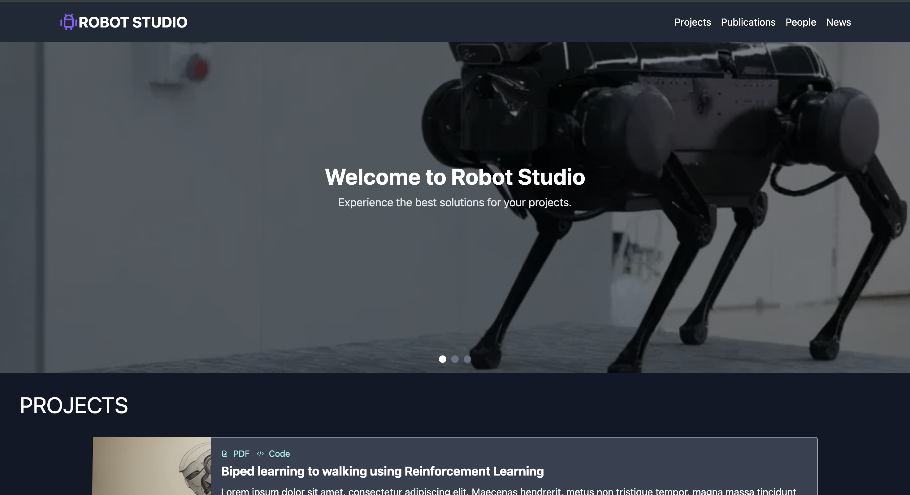
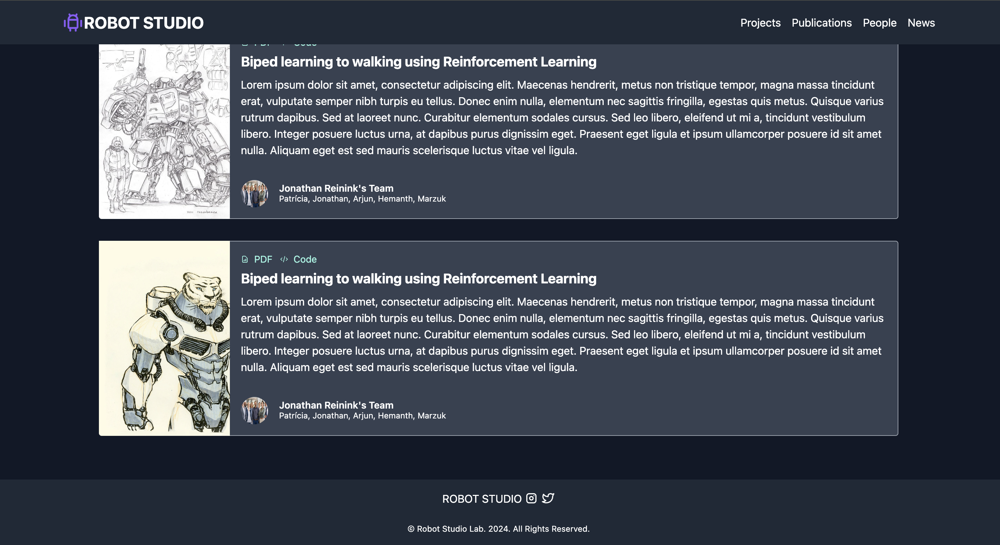

# Robot Studio Website

The website a is React SPA (Single Page Applicaiton) with [tailwindcss](https://tailwindcss.com/) for CSS.

# Running the application
After doing a git clone of the repo and navigating into the **ROBO-STUDIO** directory do :

NOTE: Ensure that you have node and npm installed.

`npm install`

Once you have successfully installed the package, you can run the development server using the following command:

`npm run start` or `npm start`

# Sample Screenshots

 
